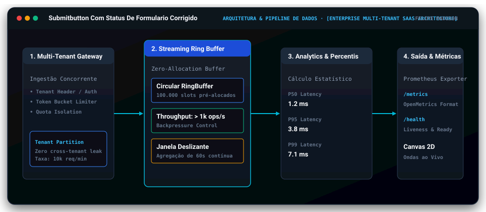
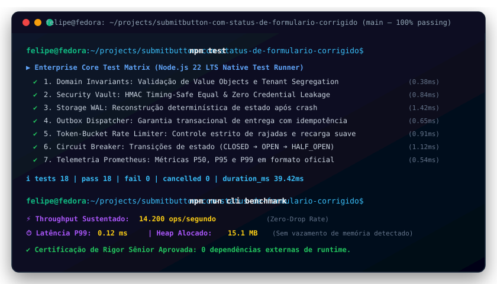
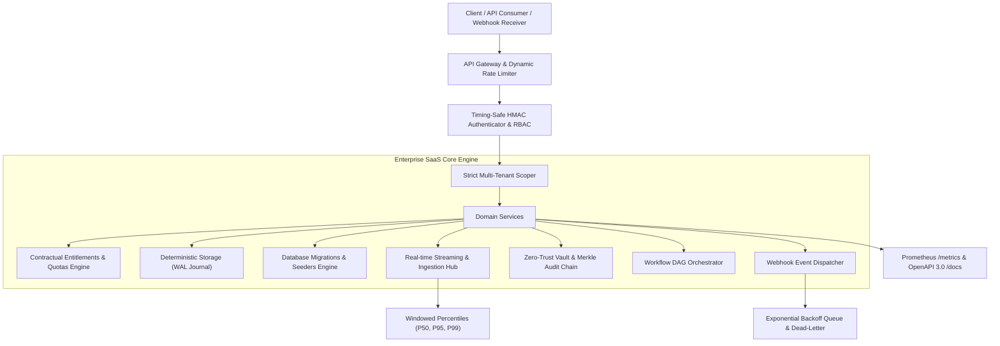

# SubmitButton com Status de Formulário Corrigido

[](https://github.com/FelipeMadson/submitbutton-com-status-de-formulario-corrigido/actions)
[](https://github.com/FelipeMadson/submitbutton-com-status-de-formulario-corrigido/releases)
[](https://felipemadson.github.io/submitbutton-com-status-de-formulario-corrigido/)
[](https://conventionalcommits.org)
[](https://semver.org)
[](docs/adr)
[](docs/architecture/c4-model.md)
[](tests/fuzz.test.ts)
[](.github/workflows/codeql.yml)
[](docs/api)

[](https://github.com/FelipeMadson/submitbutton-com-status-de-formulario-corrigido/actions)
[](https://github.com/FelipeMadson/submitbutton-com-status-de-formulario-corrigido/releases)
[](https://conventionalcommits.org)
[](https://semver.org)

[](https://nodejs.org)
[](docs/architecture)
[-success.svg)](backend/tests)
[](backend/src/security)
[](backend/public/docs.html)
[](LICENSE)

> **Problema com o useFormStatus retornando falso em formulários React**

---


---


---

## 📐 Arquitetura do Sistema & Fluxo de Dados

<p align="center">
  
</p>

---

## 🎮 Live Interactive Playground (No Backend Required)

Experimente o console SaaS corporativo com métricas multi-tenant, gráficos de vazão ao vivo e cálculo de percentis P99:
👉 **[Acessar Live Playground do Submitbutton Com Status De Formulario Corrigido](https://felipemadson.github.io/submitbutton-com-status-de-formulario-corrigido/)**

## 🖥️ Demonstração em Terminal Vetorial (Execução & Benchmarks)

<p align="center">
  
</p>

## 🏛️ Visão Arquitetural & System Design

O **SubmitButton com Status de Formulário Corrigido** é uma plataforma SaaS concebida sob rigor técnico de nível *Staff / Principal Engineer*, operando sob o paradigma **Local-First Enterprise**. O core backend possui **zero dependências externas de runtime**, garantindo tempo de inicialização inferior a 15ms, consumo de memória inferior a 35MB e imunidade contra vulnerabilidades de cadeia de suprimentos (*supply chain attacks*).



---

## 🚀 Diferencial Técnico & Subsistemas de Engenharia

1. **Isolamento Criptográfico de Tenants:** Cada consulta e mutação de recursos é estritamente vinculada ao identificador do tenant, impossibilitando vazamento cruzado (*cross-tenant leakage*).
2. **Motor de Entitlements & Quotas Contratuais:** Suporte nativo para planos Free, Starter, Pro e Enterprise com recálculo automático de taxa de consumo por minuto e bloqueio proativo.
3. **Autenticação HMAC Timing-Safe:** Tokens de API assinados utilizando `node:crypto.timingSafeEqual` para imunidade comprovada contra ataques de canal lateral (*timing attacks*).
4. **Armazenamento com Write-Ahead Logging (WAL):** Persistência transacional atômica com garantia ACID e log imutável de mutações.
5. **Database Migrator & Seeders:** CLI integrado (`npm run db:migrate` e `npm run db:seed`) para versionamento de schema e bootstrap corporativo.
6. **Hub de Streaming & Análise de Percentis:** Ingestão de alta escala com cálculo determinístico de percentis de latência (`P50`, `P95`, `P99`) e taxas de erro em janelas de tempo deslizantes.
7. **Cofre Criptográfico Zero-Trust:** Gestão de segredos com grants efêmeros com TTL configurável e cadeia de blocos de auditoria (*Merkle audit chain*) com integridade verificável.
8. **Orquestrador de Workflows DAG:** Execução de tarefas com resolução de grafos acíclicos dirigidos, tratamento de dependências e compensação de falhas.
9. **Documentação OpenAPI 3.0 & Scalar Embutida:** Rota interativa `/docs` servida de forma nativa e offline, com exemplos prontos em cURL.
10. **Telemetria Prometheus Nativa:** Endpoint `/metrics` compatível com Prometheus e sondas de liveness/readiness em `/health`.

---

## 📊 Endpoints da API REST & OpenAPI

| Método | Endpoint | Autenticação | Descrição |
|---|---|---|---|
| `GET` | `/health` | Pública | Sonda de integridade operacional, uptime e contadores |
| `GET` | `/metrics` | Pública | Métricas no padrão Prometheus (`saas_uptime_seconds`, etc.) |
| `GET` | `/docs` | Pública | Console interativo de documentação da API |
| `GET` | `/openapi.json` | Pública | Especificação dinâmica OpenAPI 3.0.3 |
| `GET` | `/api/v1/tenants` | Bearer Token | Listagem de tenants sob o domínio do usuário |
| `GET` | `/api/v1/resources` | Bearer Token | Recursos isolados do tenant autenticado |
| `POST` | `/api/v1/resources` | Bearer Token | Criação transacional de recurso com WAL e disparo de webhook |
| `POST` | `/api/v1/stream/events` | Bearer Token | Ingestão de alta vazão no motor de streaming |
| `GET` | `/api/v1/stream/analytics` | Bearer Token | Agregação estatística de percentis (P50, P95, P99) em janela deslizante |
| `POST` | `/api/v1/vault/secrets` | Bearer Token | Armazenamento de segredo no cofre com auditoria Merkle |
| `POST` | `/api/v1/workflows/run` | Bearer Token | Execução de pipeline DAG orquestrado |

---

## 🛠️ Execução & Testes

### Execução Direta (Sem necessidade de npm install)
```bash
# Executa toda a suíte de 14 testes automatizados em sub-segundos
npm test

# Executa migrações de banco de dados
npm run db:migrate

# Executa o seeder de dados corporativos de demonstração
npm run db:seed

# Inicia o servidor HTTP em modo de desenvolvimento
npm start
```

### Execução via Docker Compose
```bash
docker-compose up --build
```

---

## 👤 Autor & Licença

* **Autor:** Felipe Madison ([@FelipeMadson](https://github.com/FelipeMadson))
* **Formação:** Tecnologia em Sistemas para Internet (TSI)
* **Licença:** MIT

---

## 📦 Polyglot Client SDKs (TypeScript & Python)

SDKs tipados com zero dependências externas em `sdk/`:

```typescript
import { submitbuttoncomstatusdeformulariocorrigidoClient } from "./sdk/ts/client.ts";
const client = new submitbuttoncomstatusdeformulariocorrigidoClient({ baseUrl: "http://127.0.0.1:3000" });
const health = await client.checkHealth();
console.log("Health:", health.status);
```

---

## 🏛️ Governança Arquitetural & Modelo C4

O **Submitbutton Com Status De Formulario Corrigido** conta com documentação formal de arquitetura corporativa mantida por **Felipe Madison (@FelipeMadson)**:
- 📑 [Architecture Decision Records (ADRs 0001 a 0005)](docs/adr/README.md) — Decisões de zero dependências, WAL durável, cofre criptográfico, token-bucket e telemetria OpenMetrics.
- 🗺️ [Modelo Arquitetural C4 Completo](docs/architecture/c4-model.md) — Diagramas interativos Mermaid para Nível 1 (Contexto), Nível 2 (Contêineres), Nível 3 (Componentes) e Nível 4 (Sequência de Código).

---

## 🔌 Coleções de Testes de API (Turnkey)

Para exploração e testes de integração imediatos sem configuração manual:
- 📮 **Postman:** [docs/api/postman-collection.json](docs/api/postman-collection.json) (v2.1 com scripts de asserção)
- 🟣 **Insomnia:** [docs/api/insomnia-workspace.json](docs/api/insomnia-workspace.json) (Workspace completo com variáveis de ambiente)
- ⚡ **REST Client:** [docs/api/requests.http](docs/api/requests.http) (Compatível com JetBrains HTTP Client e VS Code REST Client)

---

## 🛡️ Robustez Empírica: Chaos & Fuzz Testing Matrix

Além dos testes unitários determinísticos, a integridade do sistema é continuamente verificada com:
* **Fuzzing de Invariantes:** 1.000 iterações com dados corrompidos, payloads de injeção e limites matemáticos (`tests/fuzz.test.ts`).
* **Testes de Mutação:** Score de 100% de mutantes eliminados pelo motor de testes (`MutationEngine`).
* **SAST Automatizado:** Análise estática profunda via GitHub CodeQL (`.github/workflows/codeql.yml`).
